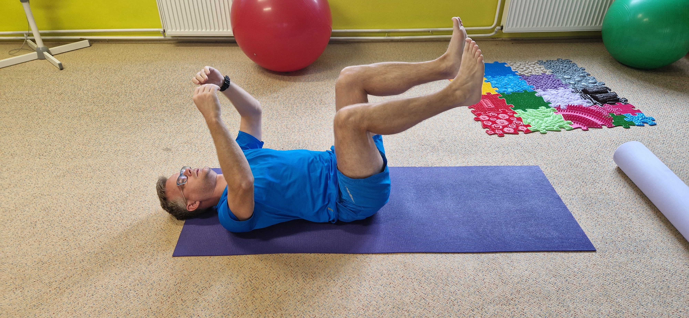
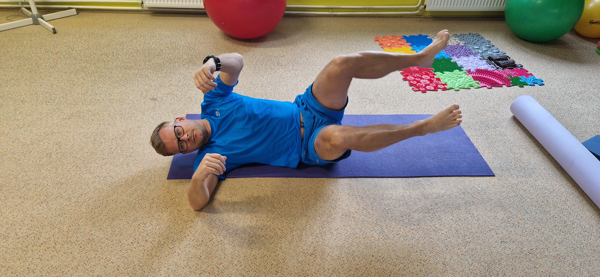

# Ortopedie a rehabilitace – Přehled cvičení

Tento dokument shrnuje rehabilitační, stabilizační a posilovací cviky upravené pro **hypermobilitu vaziva**, **flexibilní plochonoží (pes planovalgus)** a **ochranu Achillovy šlachy i myotendinózní junkce**.

---

## 1. Zásady pro hypermobilitu, plochonoží a fázování přetížení

### Terminologie fází přetížení šlachy a svalu

* **Akutní fáze (typicky 1.–3. den):**
  - *Projevy:* Ostrá, pulzující bolest, citlivost na dotek (palpaci), ranní kulhání nebo bolest při běžném došlapu; možný otok a lokální zánětlivá reakce.
  - *Režim:* Striktní klid od běhu a doskoků. Zákaz dynamické zátěže a agresivního statického protahování. Využívá se lokální chlazení, elevace a komprese.
* **Subakutní fáze (od cca 3. dne do několika týdnů):**
  - *Projevy:* Klidová bolest zcela ustoupila; chůze po rovině je bezbolestná. Bolest nebo ztuhlost se ozývá pouze při specifickém tlaku, vyšší zátěži nebo ráno po probuzení.
  - *Režim:* Fáze hojení a tvorby kolagenu vyžadující řízený mechanický podnět. Nastupuje **izometrická aktivace** (výdrže ve výponu na rovině bez pohybu), která tlumí bolest a stimuluje tkáň bez rizika poškození.
* **Přestavbová / chronická fáze (navazující po odeznění ranní ztuhlosti):**
  - *Projevy:* Izometrické zatížení je zcela nebolestivé, přetrvává potřeba adaptace šlachy na tah.
  - *Režim:* Pomalé **excentrické posilování** (spouštění paty kontrolovaně na rovné zemi, nikoli pod úroveň schodu), silová stabilizace kotníku a postupný návrat k běhu.

### Zásady a korekce pro hypermobilitu

- **Žádné spouštění pod úroveň schodu:** Excentrické posilování se provádí výhradně na rovné zemi do vodorovné polohy, aby nedocházelo k mikrotraumatům úponu a šlachy v krajní dorzální flexi.
- **Přednost aktivace před statickým strečinkem:** Vynechat agresivní tahání šlach do krajních rozsahů (hypermobilní vazivo snadno povolí v kloubu, ale šlacha zůstává přetížená). Přednost má fasciální uvolnění plosky míčkem, válcování svalů a izometrické zatížení.
- **Pohyb v osách:** Osa kolene musí při všech dřepech, výpadech i došlapech směřovat mezi 2. a 3. prst chodidla.
- **Odemykání kloubů:** Nikdy nestát a necvičit v hyperextenzi (propnutých a „zamknutých“ kolenou či loktech).

### Zásady pro správné postavení při plochonoží

- Sedět i stát s napřímenou páteří.
- Nohy na šíři kyčelních kloubů.
- Osa kolene stabilně mezi 2. a 3. prstem na noze (kolena se nesmí sbíhat k sobě).
- Stát s rovnoměrnou vahou na **3 bodech opory** (kloub palce, kloub malíku, střed paty).
- Vždy odemykat kolena při stání (udržovat mikropokrčení svalovou aktivitou).

---

## 2. Chodidlo, klenba a hlezno (m. tibialis posterior)

Tato skupina cviků zajišťuje aktivní zvedání podélné klenby, brání valgozitě paty a stabilizuje kotník proti vpadávání dovnitř.

### Aktivace 4 bodů šlapky („malá noha“)
- **Provedení:** Vsedě i ve stoje zkracovat chodidlo přitahováním kloubu palce a malíku směrem k patě. Prsty zůstávají volně natažené a položené na podlaze – nesmí se drápat do podlahy.
- **Dávkování:** 10× výdrž 6 sekund, 2–3 série denně.

### Výpony s míčkem mezi patami
- **Provedení:** Tenisový nebo masážní míček vložený mezi paty těsně pod vnitřní kotníky. Při zvedání do výponu držet stálý jemný tlak pat k sobě. Zamezuje se tak valgozitě paty a asymetrickému kroucení Achillovy šlachy.
- **Dávkování:** 3 série po 10–12 opakováních.

### Inverze chodidla s odporovou gumou
- **Provedení:** Vsedě s nataženýma nohama, posilovací guma táhne chodidlo směrem ven. Aktivním tahem vtáčet špičku dovnitř a mírně vzhůru proti odporu gumy. Pohyb musí vycházet čistě z hlezna, nikoli rotací celé nohy v koleni či kyčli.
- **Cíl:** Izolované posílení *m. tibialis posterior* – hlavního svalového držáku klenby.
- **Dávkování:** 3 série po 12–15 opakováních.

### Masáž plosky míčkem (uvolnění plantární fascie)
- **Provedení:** Rolování tvrdého míčku (masážní, lakrosový, golfový) pod celou klenbou od paty k prstovým kloubům pro uvolnění napětí v plantární fascii.
- **Dávkování:** 1–2 minuty na každou nohu denně.

### Zvedání prstů u parapetu
- **Provedení:** Stoj u parapetu s vahou rovnoměrně na 3 bodech. Zvedat všechny prsty nahoru ke stropu při zachování stálého kontaktu kloubů palce i malíku se zemí a udržení podélné klenby.
- **Dávkování:** 3 série po 12–15 opakováních.

### Cvičení se švihadlem vleže
- **Provedení:** Vleže na zádech zachytit nohu švihadlem (nebo pevným popruhem) nad patou a nohu propnout vzhůru. Malíkovou hranu chodidla tlačit vědomě dolů, zatímco vnitřní patu tlačit nahoru (korekce pronačního postavení).
- **Dávkování:** 2× 45 sekund na každou nohu.

### Zvedání vnitřních kotníků ve stoje
- **Provedení:** V klidném postoji aktivně vytahovat vnitřní kotníky nahoru a mírně ven, aniž by se odlepil kloub palce od země.

---

## 3. Lýtkový komplex a Achillova šlacha

> [!IMPORTANT]
> **Zásada bezpečnosti pro hypermobilitu:** Všechny cviky na lýtka a šlachy provádějte **výhradně na rovné zemi**. Spouštění paty pod úroveň schodu přetěžuje myotendinózní přechod v krajní dorzální flexi a může vyvolat mikrotraumata.

### 1. Fáze: Izometrická aktivace (akutní a subakutní fáze)
- **Cíl:** Analgetický účinek (tlumení bolesti), stimulace metabolismu šlachy bez mechanického natahování a rizika poškození.
- **Provedení:**
  1. Stoj na rovné zemi oběma nohama na šíři kyčlí.
  2. Zvednout se do zhruba poloviny maximálního výponu na špičky.
  3. V této poloze vydržet bez hnutí po celou dobu.
- **Dávkování:** 4–5 sérií po 30–45 sekundách, pauza 1–2 minuty mezi sériemi.

### 2. Fáze: Excentrické posilování na rovné zemi (přestavbová fáze)
- **Cíl:** Pomalá adaptace kolagenních vláken na tahovou zátěž (modifikovaný Alfredsonův protokol na rovině). Zařazovat až po odeznění ranní ztuhlosti a klidové bolesti.
- **Provedení:**
  1. Postavit se oběma nohama na rovnou podlahu.
  2. Zvednout se do plného výponu oběma nohama nahoru (koncentrická fáze obounož).
  3. Nahoře zvednout zdravou nohu do vzduchu.
  4. Na cvičené noze pomalu a kontrolovaně (3–4 sekundy) spouštět patu dolů **pouze na úroveň podlahy**.
  5. Dole se opět opřít oběma nohama pro další zvednutí.
- **Varianty kolene:**
  - *S propnutým kolenem:* Primární zatížení povrchového lýtkového svalu (*m. gastrocnemius*).
  - *S mírně pokrčeným kolenem (cca 20–30°):* Primární zacílení na hluboký lýtkový sval (*m. soleus*), který tvoří většinu objemu Achillovky.
- **Dávkování:** 3 série po 10–12 opakováních pro obě varianty kolene.

---

## 4. Hluboký stabilizační systém (HSS), DNS a diastáza

Centrální stabilita trupu eliminuje rotace pánve, pomáhá symetrii došlapu a snižuje asymetrické přetížení nohou při běhu i chůzi.

### Diastáza a příprava hrudního koše
1. **Masáž žeber míčkem:** Jemné rolování měkkého nebo masážního míčku podél žeberních oblouků a od středu hrudníku směrem do stran (uvolnění bránice a mezižeberních fascií).
2. **Kožní řasa:** Prohmatání a uvolnění tkání podél linea alba.
3. **Aktivace nitrobřišního tlaku:** Hluboký nádech nosem směrem do břicha, boků a beder (pocit rozepnutí válce 360°), následovaný plynulým výdechem se zpevněním břišní stěny bez vtahování pupku k páteři.

### Poloha 3. měsíce na zádech (DNS podle prof. Koláře)

- **Výchozí poloha:**
  - Leh na zádech, kyčle i kolena v úhlu 90°, bérce rovnoběžně se zemí, chodidla uvolněná.
  - Paže směřují kolmo ke stropu, ramena a lopatky stažené od uší dolů do podložky, brada mírně zasunutá.
  - Spodní žebra stažená dolů k pánvi, bedra v neutrální poloze (ani příliš prohnutá, ani násilně přitisknutá).
  - Dýchání do břicha a do boků (udržení nitrobřišního tlaku).
- **Dávkování:** Výdrž 3× 30–60 sekund.

### Přetáčení na bok z polohy 3. měsíce

- **Provedení:**
  - Hlava a pohled očí zahajují pohyb, horní ruka vede rotaci trupu.
  - Trup se otáčí jako **jeden kompaktní válec** současně s pánví; dolní končetiny drží konstantní úhel 90° ve vzduchu.
  - Pomalý a plně řízený pohyb bez švihu nohou a bez odtlačování se loktem od země.
- **Dávkování:** 5× na každou stranu, maximální plynulost.

#### Na co je blok DNS zaměřený
- Aktivace hlubokého stabilizačního systému: bránice, *m. transversus abdominis*, svaly pánevního dna a hluboké zádové svaly (*mm. multifidi*).
- Nácvik správného nitrobřišního tlaku a dechového stereotypu.
- Rotační stabilita trupu (klíčová pro eliminaci asymetrie v kontaktu se zemí při běhu).

#### Časté chyby při DNS
- Prohnutá bedra s vyklenutým hrudníkem a vystrčenými spodními žebry.
- Zadržování dechu při pohybu.
- Tah v tříslech (přetížení flexorů kyčlí namísto hlubokého břicha).
- Předsunutá hlava, napětí v krku a švihový pohyb nohama.

---

## 5. Pánev, hýždě a kyčle (Gluteální stabilizace)

Slabost abduktorů a zevních rotátorů kyčle vede k valgóznímu propadu kolene dovnitř a následnému zhroucení klenby a přetížení vnitřní strany Achillovky.

### Clamshells (Mušle)

#### Provedení
- Leh na boku, hlava podložená paží nebo polštářem, tělo v jedné přímce (ramena, kyčle a paty v ose).
- Kolena pokrčená do cca 90°, chodidla spočívají na sobě, paty v linii páteře.
- Horní ruka opřená před hrudníkem, břišní stěna aktivní, pánev stabilní.
- S výdechem zvedat horní koleno nahoru (otevírání mušle), chodidla zůstávají spojená.
- Pánev se nesmí zaklánět dozadu ani rotovat – pohyb vychází výhradně z kyčelního kloubu.
- Nahoře výdrž 1–2 sekundy, pomalý návrat dolů.
- *Zvýšení obtížnosti:* Krátká elastická guma (miniband) umístěná nad koleny.
- **Dávkování:** 10–15 opakování, 2–3 série na každou stranu.

#### Na co je zaměřený
- *M. gluteus medius* a *minimus* (zevní rotátory a abduktory kyčle).
- Stabilita pánve; zamezení vpadávání kolen dovnitř při chůzi, běhu a dřepech.

#### Časté chyby
- Přetáčení pánve vzad pro dosažení většího rozsahu.
- Zapojování svalů trupu místo izolované práce hýždí.

---

### Ukopy s power bandem do 3 směrů

#### Provedení
- Elastická guma (power band / loop band) navlečená nad kotníky (lehčí varianta) nebo nad kolena (větší zacílení na hýždě).
- Stoj vzpřímený, pro rovnováhu je možné se lehce dotýkat stěny či židle (neopírat se plnou vahou).
- **Stojná noha:** Mírně pokrčená (odemknuté koleno), váha stabilně na 3 bodech chodidla, osa kolene míří mezi 2. a 3. prst.
- Cvičenou nohou provádět kontrolované ukopy proti odporu gumy:
  1. **Do strany (unožení):** Špička směřuje dopředu (nevyáčet ven), pohyb vede pata a zevní strana stehna.
  2. **Dozadu (zanožení):** Pohyb vychází čistě ze zanožení v kyčli bez prohýbání v bedrech.
  3. **Dopředu (přednožení):** Koleno propnuté, špička přitažená k holeni.
- **Dávkování:** 10–15 opakování každým směrem, 2–3 série na každou nohu.

#### Tempo a mechanika odporu
- Pohyb není švihový – odpor gumy pracuje v obou fázích.
- **Pohyb ven:** cca 1–2 s, plynulý tah bez trhnutí.
- **Krajní poloha:** Výdrž 1 s s udržením stabilní pánve.
- **Návrat:** Pomalé brzdění 2–3 s (nenechat gumu nekontrolovaně stáhnout nohu zpět).
- Mezi opakováními guma nikdy zcela nepovolí – noha zůstává v mírném napětí.
- Dýchání: Výdech při tahu proti gumě, nádech při brzděném návratu.

#### Časté chyby
- Náklon trupu na stranu nebo rotace pánve pro umělé zvětšení rozsahu.
- Prohnutí v bedrech při zanožování.
- Zamknuté (propnuté) koleno a zhroucená klenba na stojné noze.

---

### Částečný dřep (Semi-squat)
- **Provedení:** Postoj na šíři ramen, váha rovnoměrně rozložená na 3 bodech chodidel. Klesat do dřepu pouze do hloubky cca 90° v kolenou (případně mělčeji podle kontroly os).
- **Klíčové zaměření:** Kolena musí po celou dobu přesně kopírovat osu 2. a 3. prstu nohy. Nesmí dojít k jejich vbočení dovnitř (dynamická valgozita).
- **Dávkování:** 2–3 série po 10 opakováních.

### Výpady vzad
- **Provedení:** Ze stoje krok jedné nohy vzad s došlapem na špičku a plynulým poklesem těžiště. Přední noha nese většinu hmotnosti, koleno přední nohy drží stabilní osu nad 2.–3. prstem.
- **Dávkování:** 2 série po 8–10 opakováních na každou nohu.

---

## 6. Horní polovina těla – Paže a triceps

Silná horní polovina těla a stabilní triceps podporují správné držení těla, práci paží při běhu a stabilitu ramenního pletence při cvičení s oporou.

### Zásady pro cvičení tricepsu
- Loket je jediný pohyblivý kloub – poloha ramene, nadloktí a zápěstí zůstává fixovaná.
- Lokty držet u těla, nerozjíždět je do stran; ramena stáhnout dolů od uší a lopatky zafixovat.
- Trup zpevněný stejně jako u DNS: spodní žebra stažená, bedra v neutrální poloze, bez záklonu.
- Tempo: propnutí 1–2 s, výdrž 1 s, kontrolovaný návrat 2–3 s. Dýchání: výdech při propnutí lokte, nádech při návratu.
- **Pozor na hypermobilitu:** Loket nikdy nepropínat do hyperextenze („nezamykat“ kloub). Pohyb zastavit těsně před plným propnutím svalu.

### Kliky s úzkým držením (Triceps push-up)
- **Provedení:** Vzpor ležmo (nebo lehčí varianta: dlaně na vyvýšeném stole, parapetu či kliky na kolenou). Dlaně na šíři ramen přímo pod ramenními klouby, prsty směřují dopředu.
- Lokty se při klesání pohybují těsně podél trupu dozadu – z pohledu shora svírají paže s tělem tvar „šipky“ (nikoli písmena „T“).
- Tělo tvoří rovnou přímku od hlavy k patám, břicho a hýždě jsou aktivní.
- S nádechem klesat dolů, s výdechem se silou tricepsů odtlačit nahoru.
- **Dávkování:** 8–12 opakování, 2–3 série.

### Tricepsové tlaky s power bandem v předklonu (Kickback)
- **Provedení:** Posilovací gumu zašlápnout jednou nohou, konec uchopit do ruky na stejné straně.
- Mírný předklon v kyčlích s napřímenou páteří, druhá ruka opřená o koleno nebo pevnou židli.
- Loket ohnutý do 90° přitisknutý k boku, nadloktí vodorovně s trupem – tato poloha nadloktí je po celou dobu neměnná.
- S výdechem propnout loket dozadu do roviny s paží, podržet 1 sekundu. S nádechem pomalu vracet zpět a brzdit tah gumy.
- **Dávkování:** 12–15 opakování, 2–3 série na každou ruku.

### Tlaky nad hlavou s power bandem (Overhead extension)
- **Provedení:** Ve stoji nebo vsedě s rovnými zády (při tendenci k prohýbání sednout zády ke zdi). Gumu zašlápnout nohama, konce uchopit do dlaní a zvednout paže nad hlavu.
- Lokty směřují dopředu a vzhůru, nadloktí zůstává svisle vedle uší.
- S nádechem spouštět předloktí za hlavu, s výdechem kontrolovaně vytlačit lokty zpět vzhůru.
- **Cíl:** Zacílení na dlouhou hlavu tricepsu (*caput longum*).
- **Dávkování:** 10–15 opakování, 2–3 série.

### Tricepsové kliky o židli (Dips) – volitelně
- **Provedení:** Sed na hraně pevné židle, dlaně vedle boků prsty dopředu. Posunout pánev před hranu, nohy pokrčené (lehčí) nebo natažené (těžší).
- Ohýbat lokty přímo dozadu a spouštět tělo maximálně do úhlu 90° v lokti, ne níže. S výdechem se vytlačit zpět.
- > [!CAUTION]
  > Kdo má sklon k nestabilitě nebo bolesti v přední části ramene, dipy vynechá a nahradí je bezpečnějším kickbackem.
- **Dávkování:** 8–12 opakování, 2 série.

### Šetrné protažení tricepsu
- Ruku zvednout nad hlavu, pokrčit v lokti a dlaň položit mezi lopatky. Druhou rukou jemně vést loket dozadu a mírně dolů. Držet 20–30 sekund, 2× na každou paži.
- Žebra držet dole, neprohýbat bedra. Zařazovat až po docvičení.

---

## 7. Regenerace, uvolnění měkkých tkání a bezpečný strečink

> [!WARNING]
> **Specifika strečinku u hypermobility:**  
> Hypermobilní jedinec snadno dosáhne velkého rozsahu pohybu povolením vazů a kloubních pouzder, což může paradoxně zhoršit nestabilitu a přetížit svalové úpony.  
> - **Nikdy neprotahujte agresivně přes odpor či bolest.**  
> - **Přednost má fasciální rolování (válec, míček)**, které uvolní svalový tonus bez přetěžování kloubů.  
> - Vynechte silové páčení achilovek do krajní dorzální flexe.

### Fasciální uvolnění (Válec a míček)
- **Ploska nohy:** Masážní míček pod klenbou (1–2 minuty denně).
- **Přední stehna (Quadriceps):** Pomalé válcování na pěnovém válci vleže na břiše.
- **Lýtkové svaly:** Pěnovým válcem projíždět svalová bříška lýtek. **Vyhýbat se přímému silovému tlaku na samotnou Achillovu šlachu a patní kost.**

### Bezpečné protažení vybraných svalových partií
- **Zadní strana stehen (Hamstringy) v sedě:** Sed s oporou zad o stěnu, nohy natažené, špičky jemně přitažené k sobě. Vnímat lehký tah v zadních stehnech a horní části lýtek při zachování rovných zad (výdrž 30 sekund).
- **Zadní strana stehna vleže:** Leh na zádech, pánev leží celou plochou na podložce. Zvedat jednu nohu s mírně pokrčeným kolenem vzhůru rukama za stehno (výdrž 30 s).
- **Přední strana stehna (Quadriceps):** Vleže na břiše přitáhnout patu k hýždi rukou nebo popruhem, pánev mírně podsazená (netlačit břicho do podložky prohnutím v bedrech).
- **Prsty „na pavouka“ u parapetu (axiální uvolnění zadního řetězce):** Špičky prstů opřít o hranu parapetu se zvednutým zápěstím, mírně se předklonit v kyčlích do pravého úhlu, záda rovná. Vnímat protažení zádových svalů a zadních stehen s hlubokým dechem.
- **Šetrné uvolnění lýtka (m. soleus):** Stoj u stěny, cvičená noha vzadu s pokrčeným kolenem a patou na zemi. Jemný tah v hloubce lýtka bez páčení achilovky.

---

## 8. Journal – záznamy z lekcí ortopedického cvičení

Strukturovaný přehled metodiky z absolvovaných lekcí ortopedické rehabilitace zaměřené na ploché nohy a stabilizaci os končetin:

### 1. lekce – Vnímání a aktivace opory plosky
1. **Aktivace 4 bodů na šlapce:** Kloub palce, kloub malíku, vnitřní a vnější pata – nácvik vědomého kontaktu v sedě a následně ve stoji.
2. **„Housenky“ v sedě:** Přitahování plosky dopředu aktivním zapojením krátkých svalů chodidla (bez drápání prstů do křeče).
3. **Zvedání vnitřních kotníků ve stoje:** Aktivace podélné klenby a *m. tibialis posterior* vytažením kotníků vzhůru při stálé opoře palcového kloubu.

### 2. lekce – Uvolnění a separace segmentů
1. **Šetrné protahování lýtka:** Klasické postavení s důrazem na pokrčené koleno a měkké uvolnění bez přepětí v úponu.
2. **Jemné uvolnění nártu:** Lehké protažení horní strany hlezna.
3. **Protažení zadní části nohy s vytočením pánve:** Ve stoje položit patu na nízkou stoličku či židli, prsty uvolněné, mírná rotace pánve proti stojné noze pro izolovaný tah zadního řetězce.

### 3. lekce – Zapojení trupu a axiální stabilizace
1. **Prsty „na pavouka“ na parapetu:** Opora o špičky prstů se zvednutým zápěstím, trup v pravém úhlu, rovná záda, integrace bráničního dechu a stabilizace lopatek.

### 4. lekce – Funkční korekce klenby a supinace
1. **Zvedání prstů u parapetu:** Přímý postoj, opora na 3 bodech, zvedání prstů s důsledným udržením podélné klenby.
2. **Trakce a korekce švihadlem vleže:** Leh na zádech, noha zachycená švihadlem nad patou; aktivní tlačení malíkové hrany dolů a vnitřní paty nahoru pro korekci pronačního postavení hlezna.